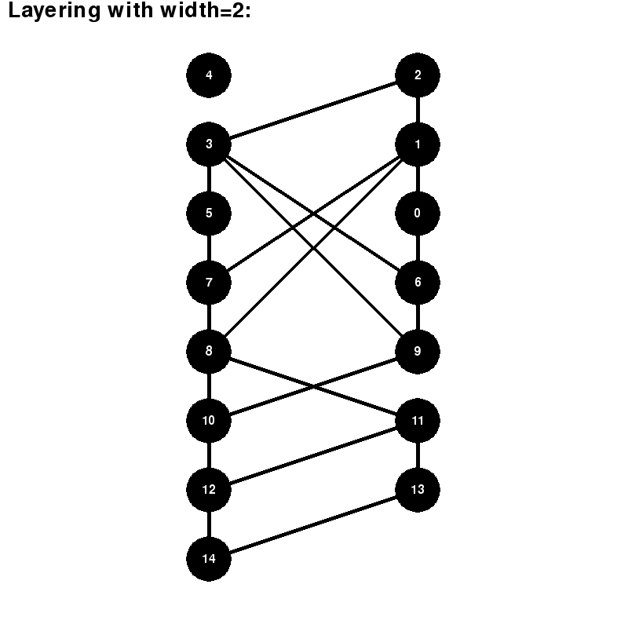
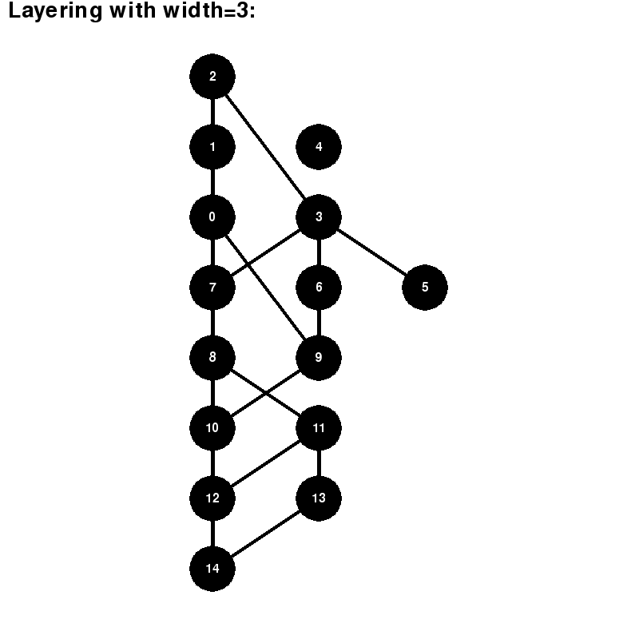

# Coffman-Graham acyclic graph layering algorithm
The algorithm takes a graph as a sequence of edges for each vertex and split vertex by layers according to [Coffman-Graham algorithm](https://en.wikipedia.org/wiki/Coffman%E2%80%93Graham_algorithm), 
i.e. a graph `1->2->3` should be layered as follows:
```
1
2
3
```


Here are examples of visualized layerings:





## How to use
### Prerequisites:
* `g++` supporting c++14
* `cmake` >= 3.10
* `python` >= 3.7
* `pygame` >= 1.9.6

### Run algortihm
Currently graph needs to be loaded only straight in `main.cpp` 
and for every vertex edges should be explicitly named (even if there aren't any)

As a result C++ code will output number of vertices in original graph, graph itself as a sequence of edges, number of layers in a layering and the layering starting from the top level.

Place the output into `input.txt` and run Render.py to visualize rendering. 

## License
This project is licensed under the MIT License - see the [LICENSE.md]() file for details

## Acknowledgments
The project is made a part of Data Visualization course at MIPT in autumn 2019.

Description of the algorithm was taken from `Battista, Eades, Tamassia, Tollis — Graph Drawing. Algorithms for the Visualization of Graphs`

